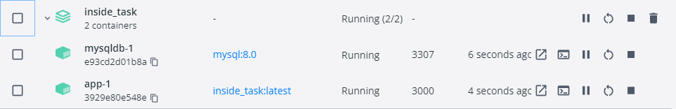

# Inside Task

>- Добавить описание и инструкцию по запуску и комментарии в коде, если изменяете формат сообщений, то подробное описание ендпоинтов и их полей.
>- Завернуть все компоненты в докер, покрыть код тестами.
>- Проект необходимо выкладывать на github и docker hub. Обязательно наличие readme-файла.
>- Порт не 8080
>- Составить запросы (curl) через терминал для проверки работоспособности вашей программы (приложить файл с запросами).

## Инструкция по запуску
1. Запуск программы через
```Java
InsideTaskApplication
```
2. Логинимся по url: localhost:3000/auth/login по Post-запросу
```JSON
name: "dmitry"
password: "qwerty"
```
3. Переходим в Headers, в столбце Key находим token и копируем его в столбце Value и записываем его в таком же формате.
4. После авторизации токена, который будет действенным 30 минут с момента последнего запроса, мы можем делать запросы.
5. Post запрос на добавление сообщения от имени пользователя по url **_localhost:3000/message/send_**:
- cоздаем Json -запрос формата:
```JSON
{
    "user_id": "1", // где user_id это связь с нашим user'om из БД
    "name": "dmitry",
    "message": "Hello world"
}
```
- Данное сообщение сохранится в БД.
6. Post запрос на возврат последних 10 сообщений от конкретного пользователя по url _**localhost:3000/message/send**_ :
- создаем Json - запрос аналогичного формата, но меняем message на ключевое "history 10"
```Json
{
    "user_id": "1",
    "name": "dmitry",
    "message": "history 10"
}
```
- После отправки нам возвращаются последние 10 сообщений от пользователя под id 1.
7. Также сгенерированы другие запросы. Например Get запросы по вызову списка всех 
User'ов или сообщений от всех User'ов:
```xhtml
        localhost:3000/users/ - вызов всех пользователей
        localhost:3000/userdata/ - вызов всех дополнительных данных пользователя
        localhost:3000/message/ - вызов сообщений всех пользователей
```

## Тестирование для cURL
1. Выполняем авторизацию, получаем токен
```http request
curl -v http://localhost:3000/auth/login
```
2. Получаем список всех пользователей
```http request
curl --header "x-csrf-token: (полученный токен)" http://localhost:3000/users/
```
3. Получаем список данных всех пользователей
```http request
curl --header "x-csrf-token: (полученный токен)" http://localhost:3000/userdata/
```
4. Получаем список сообщений всех пользователей
```http request
curl --header "x-csrf-token: (полученный токен)" http://localhost:3000/message/
```
5. Добавляем сообщение конкретного пользователя в базу данных
```http request
curl -X POST http://localhost:3000/message/send -d "{\"user_id\":1,\"name\":\"qqq1\",\"message\":\"Hello\"}" -H "Content-Type: application/json"  --header "x-csrf-token: (полученный токен)"
```
6. Получаем последние 10 сообщений от конкретного пользователя
```http request
curl -X POST http://localhost:3000/message/send -d "{\"user_id\":1,\"name\":\"qqq1\",\"message\":\"history 10\"}" -H "Content-Type: application/json"  --header "x-csrf-token: (полученный токен)"
```
## Скачать
Скачать с Github 
```Java
скачать https://github.com/dmitrishkod/inside_task/archive/refs/heads/master.zip
```
## Запуск через Docker (не актуально)
1. Установим настройки подключения к mysql в application.properties
```JAVA
spring.datasource.url = jdbc:mysql://mysqldb:3306/inside_task
spring.datasource.username = sys
spring.datasource.password = 1234
```
2. Cобираем исполняемый файл (таргет)
```JAVA
mvn clean package
```
3. Cкрипт запуска таргета
```JAVA
java -jar target/inside_task-0.0.1-SNAPSHOT.war
```
4. создаем Dockerfile, запускаем контейнер
```JAVA
docker compose up
```
 
5. Собираем образ
```JAVA
docker build --tag=inside_task:latest .
```
6. Устанавливаем mysql
```JAVA
docker pull mysql:8.0
```
7. Создаем соединение для mysql
```JAVA
docker network create inside_task_mysqlnet
```
8. Запускаем образ базы данных
```JAVA
docker run -it --name mysqldb --network=inside_task_mysqlnet -e MYSQL_ROOT_PASSWORD=1234 -e MYSQL_DATABASE=inside_task -e MYSQL_USER=sys -e MYSQL_PASSWORD=1234 -d mysql:8.0
``` 
9. Чтобы узнать запущенные контейнеры, их порты и айди
```JAVA
docker ps
```
10. Собираем контейнер приложения
```JAVA
docker build --tag=inside_task .
```
11. app

12. Запуск контейнера с приложением
```JAVA
docker run --network=inside_task_mysqlnet --name inside_task_container -p 8887:8888 -d inside_task
```
## Задание
>- В БД создать пару sql табличек со связями (foreign keys)
>- Сделать HTTP POST эндпоинт, который получает данные в json вида:
```Java
name: "имя отправителя"
password: "пароль"
```
Этот эндпоинт проверяет пароль по БД и создает jwt токен (срок действия токена и алгоритм 
подписи не принципиален, для генерации и работе с токеном можно использовать готовую
библиотечку) 

```Java
В токен записывает данные: name: "имя отправителя" и отправляет токен в ответ,
        тоже json вида:
    token: "тут сгенерированный токен"
```
Сервер слушает и отвечает в какой-нибудь эндпоинт, в него на вход поступают данные в формате json:

```Java
Сообщения клиента-пользователя:
    name:       "имя отправителя",
    message:    "текст сообщение"
```
>- В заголовках указан Bearer токен, полученный из эндпоинта выше (между Bearer и полученным токеном должно быть нижнее подчеркивание).
Проверить токен, в случае успешной проверки токена, полученное сообщение сохранить в БД.

Если пришло сообщение вида:
```Java
    name:       "имя отправителя",
    message:    "history 10"
```
>- Проверить токен, в случае успешной проверки токена отправить отправителю 10 последних сообщений из БД
 

## Инструменты/библиотеки
>- IDEA Community Edition
>- Git
>- Maven
>- MySQL DB
>- Java 8
>- Spring Boot/Spring Security
